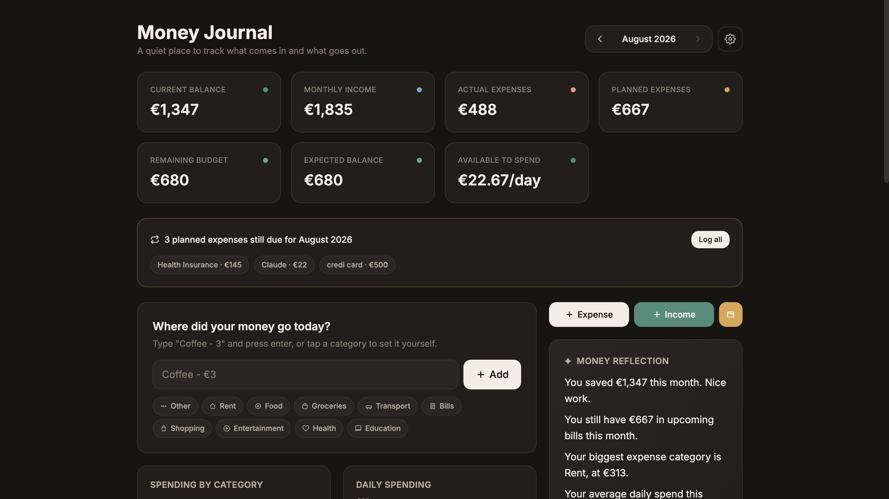
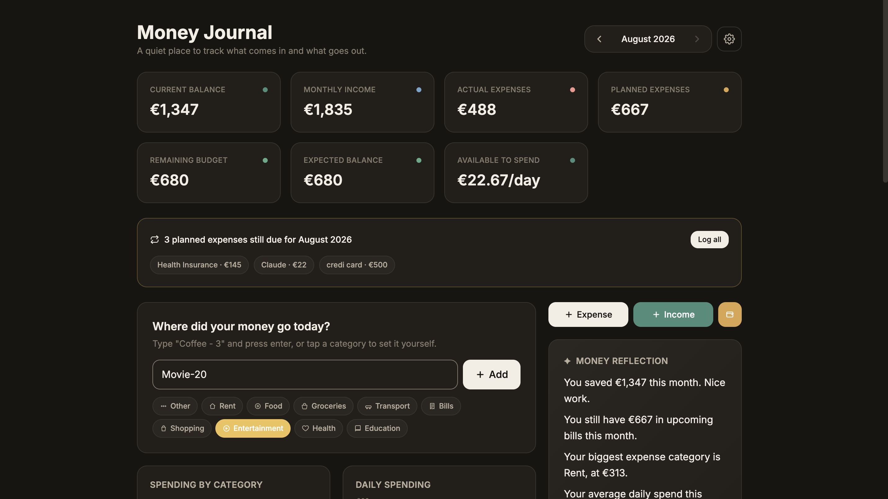

# Money Journal

[](https://github.com/<your-username>/money-journal/actions/workflows/ci.yml)
[](./LICENSE)

A private, local-first personal finance dashboard. Track income and daily
expenses, plan recurring bills, and get a quick daily read on your money -
without an account, a server, or anyone but you ever seeing the data.

> This is a personal finance **journal and dashboard**, not a banking app, a
> fintech product, or an accounting system. It doesn't connect to your bank,
> doesn't move money, and doesn't know your name.

## Why this exists

Most personal finance apps ask for a login, sync your transactions to a
cloud, and quietly build a profile of your spending to sell you something.
Money Journal takes the opposite approach: it's a static, single-user, local
tool meant to answer one question every day - *where did my money go, and how
am I doing this month?* - in under 15 seconds, with zero data ever leaving
your device.

## Features

- **Income and expense tracking** with categories, payment methods, and notes.
- **Quick-add** for daily expenses - type `Coffee - 3`, press enter, done.
  Categories are guessed automatically from what you type, with one-click
  category chips to correct or confirm.
- **Budget items** - unlimited custom recurring costs (rent, subscriptions,
  insurance, debt payments, anything) with their own category, amount, and
  recurrence (monthly, weekly, yearly, or one-time). They reappear
  automatically every month without being recreated, and track Paid vs.
  Planned status (Upcoming, Partial, Completed, Overdue) as you log them.
- **Dashboard overview** that combines actual income, actual expenses, and
  planned budget items into one accurate picture: current balance, monthly
  income, actual expenses, planned expenses, remaining budget, expected
  end-of-month balance, and available-to-spend per day.
- **Monthly financial summary** - fixed vs. variable spending, savings,
  budget utilization %, largest expense, and largest budget category.
- **Charts** - spending by category (donut), daily spending timeline, and a
  six-month trend, kept deliberately simple.
- **Money Reflection** - short, rule-based (no external AI) observations
  like "you saved €300 this month" or "you tend to spend more on weekends,"
  scored and prioritized so only the most relevant few show at a time.
- **Transaction history** - day-grouped, searchable, filterable by category,
  editable in place, with an undo window on delete instead of instant,
  unconfirmed removal.
- **Dark mode**, currency selection, and JSON export/import in Settings.
- **Fully local** - everything is stored in your browser's `localStorage`.
  Nothing is sent anywhere, ever.

## Screenshots

<!--
  Add screenshots here before publishing, for example:

  
  
  
-->

_Screenshots coming soon - run the app locally (see below) to see it live in
the meantime._

## Privacy-first philosophy

This is the part that doesn't change, ever:

- **No user accounts.** There is nothing to sign up for.
- **No authentication.** There is no login, because there is no server.
- **No analytics.** No usage tracking, no event pings, no "anonymous" metrics.
- **No tracking.** No cookies for tracking purposes, no fingerprinting.
- **No cloud storage.** Your data is never uploaded anywhere.
- **No external database.** There is no backend at all - this is a static
  site.
- **No personal information collected**, because nothing is collected.
- **No third-party requests of any kind.** The Inter font is self-hosted and
  bundled into the build rather than fetched from a font CDN, so opening the
  app contacts no one - not even for a stylesheet.

All financial data lives in your browser's `localStorage`, on your device,
under your control. Clearing your browser data clears the app's data. Export
a backup from Settings before doing that if you want to keep it.

You can verify the "no third-party requests" claim yourself: open the browser
devtools Network tab, hard-reload the app, and confirm that every request is
same-origin.

See `SECURITY.md` for the honest threat model (what "local-only" does and
doesn't protect against).

## Data safety and backups

Because there is no cloud copy, the app takes local durability seriously:

- **Automatic backup.** Every time your data changes, the previous known-good
  save is copied to a separate `localStorage` key. If the main record is ever
  corrupted, the app detects it on load and restores that snapshot
  automatically, telling you it did so.
- **Manual export / import.** Settings → Data lets you download your full
  data as a JSON file, and import one back. Imports are validated (shape,
  schema version, and date fields) before they are allowed to replace live
  data, and always ask for confirmation first.
- **Restore automatic backup.** Settings → Data can also roll back to the
  automatic snapshot directly.
- **Honest save failures.** If the browser refuses to persist (storage full,
  private-browsing mode, storage disabled), the app shows a warning banner
  instead of pretending the save worked.
- **Schema versioning.** Saved data records the schema version it was written
  with, and older payloads are migrated forward through an explicit migration
  chain (`src/lib/storage.js`). A backup exported today will still import
  correctly after future schema changes.
- **Crash recovery.** If a rendering error ever occurs, an error boundary
  shows a recovery screen with a "Download my data" button that reads
  straight from `localStorage` - so even a broken UI can't lock you out of
  your records.

Recommended habit: export a JSON backup every month or so and keep it
somewhere you control.

## Getting started

### Prerequisites

- [Node.js](https://nodejs.org/) 18 or newer
- npm (comes with Node)

### Installation

```bash
git clone https://github.com/<your-username>/money-journal.git
cd money-journal
npm install
```

### Running locally

```bash
npm run dev
```

Opens a dev server (default `http://localhost:5173`) with hot reload.

### Building for production

```bash
npm run build
```

Outputs a static site to `dist/`. Because this app has no backend, `dist/`
can be hosted anywhere that serves static files (GitHub Pages, Netlify,
Vercel, or your own machine).

```bash
npm run preview
```

Serves the production build locally to sanity-check it before deploying.

### Linting and formatting

```bash
npm run lint     # ESLint - must pass with zero errors
npm run format   # Prettier
```

CI runs install → lint → build on Node 18, 20, and 22 for every push and pull
request (`.github/workflows/ci.yml`).

## Folder structure

```
money-journal/
├── .github/workflows/ci.yml     # install / lint / build on push + PR
├── index.html                   # Vite entry HTML (metadata, favicon, manifest)
├── public/
│   ├── favicon.svg
│   └── site.webmanifest
├── package.json
├── vite.config.js
├── tailwind.config.js
├── postcss.config.js
├── eslint.config.js
├── src/
│   ├── main.jsx                 # React root, self-hosted font imports
│   ├── App.jsx                  # Top-level app: state, wiring, layout
│   ├── index.css                # Tailwind + design tokens (CSS variables)
│   ├── constants.js             # Categories, colors, recurrence types, version
│   ├── context/
│   │   └── SettingsContext.jsx  # Currency/theme context + formatCurrency
│   ├── lib/                     # Framework-free logic (unit-testable)
│   │   ├── dateUtils.js
│   │   ├── format.js
│   │   ├── categorize.js
│   │   ├── storage.js           # load/save, schema versioning, migrations, backup
│   │   ├── budget.js            # planned/paid/status calculations
│   │   ├── reflections.js       # rule-based "Money Reflection" engine
│   │   ├── theme.js
│   │   └── id.js
│   └── components/
│       ├── ErrorBoundary.jsx    # crash screen with data-recovery export
│       ├── AboutModal.jsx       # project + privacy explainer
│       ├── UndoToast.jsx
│       ├── common/              # Icons, Modal, FormField, ToggleSwitch, ...
│       ├── dashboard/           # DashboardCards, MoneyReflection, summary
│       ├── charts/              # CategoryDonut, TrendChart, DailyTimeline
│       ├── expenses/            # QuickAdd, forms, TransactionHistory
│       ├── budget/              # BudgetModal, BudgetItemForm, banners
│       └── settings/            # SettingsModal (export / import / restore)
├── CHANGELOG.md
├── CONTRIBUTING.md
├── CODE_OF_CONDUCT.md
├── SECURITY.md
└── LICENSE
```

## Roadmap

Ideas that fit the project's philosophy and may show up in future releases:

- An automated test suite for `src/lib` (highest priority after v1.0.0)
- Savings goal tracker (target amount + date, progress bar)
- Calendar heatmap view of daily spending
- Side-by-side month-over-month comparison view
- Code-splitting the chart bundle to cut first-load size
- Optional client-side encryption of the exported backup file

### Explicit non-goals

To keep this project small and trustworthy, the following are intentionally
**out of scope** and won't be added, regardless of how often they're
requested:

- User accounts or authentication
- Bank or open-banking integrations
- Investment or portfolio tracking
- Tax computation
- Multi-user or shared-household support
- Any backend server, database, or analytics/telemetry

See `CONTRIBUTING.md` for the reasoning behind this list.

## License

MIT - see `LICENSE`. Contributions are welcome; please read
`CONTRIBUTING.md` and `CODE_OF_CONDUCT.md` first.
